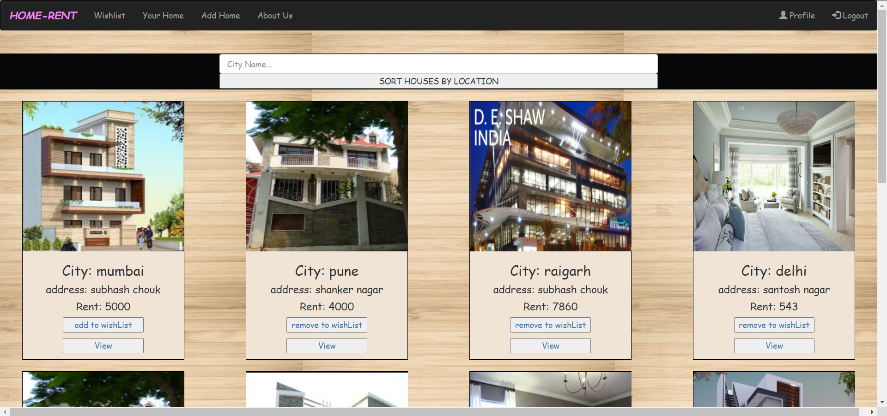
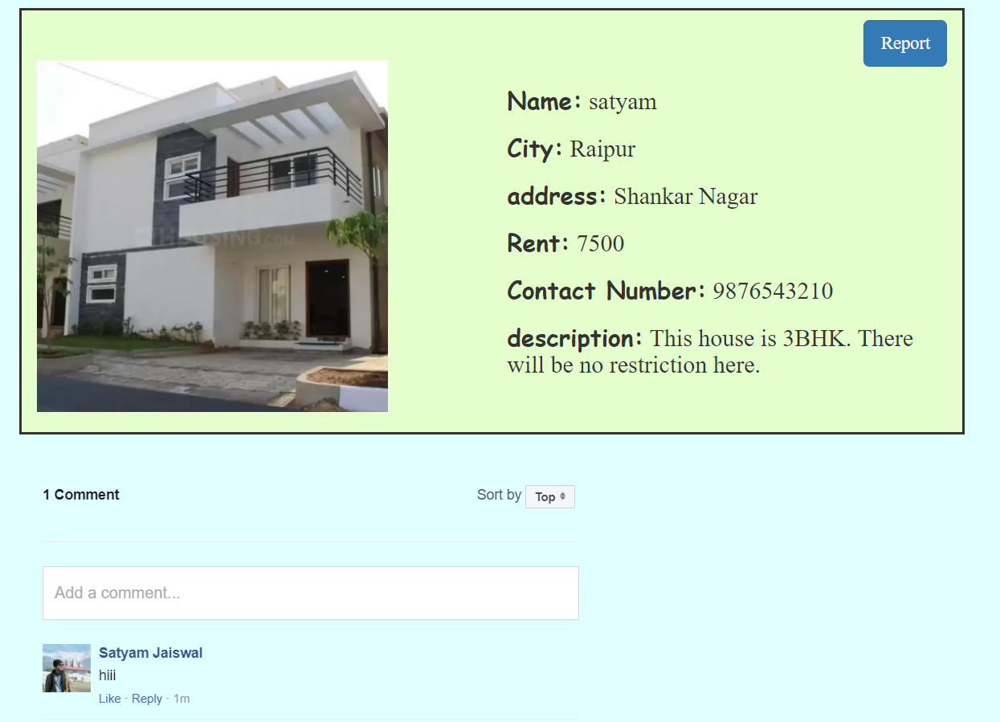
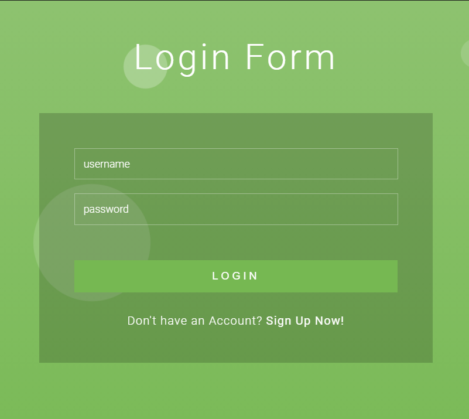
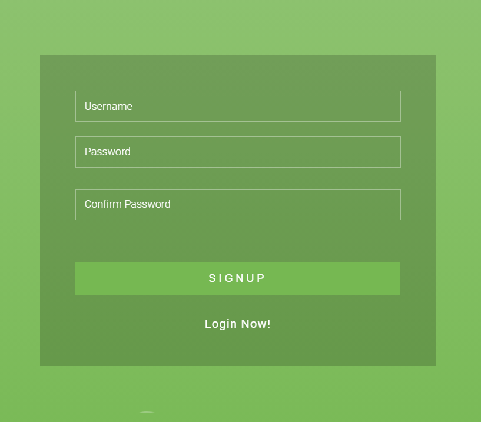
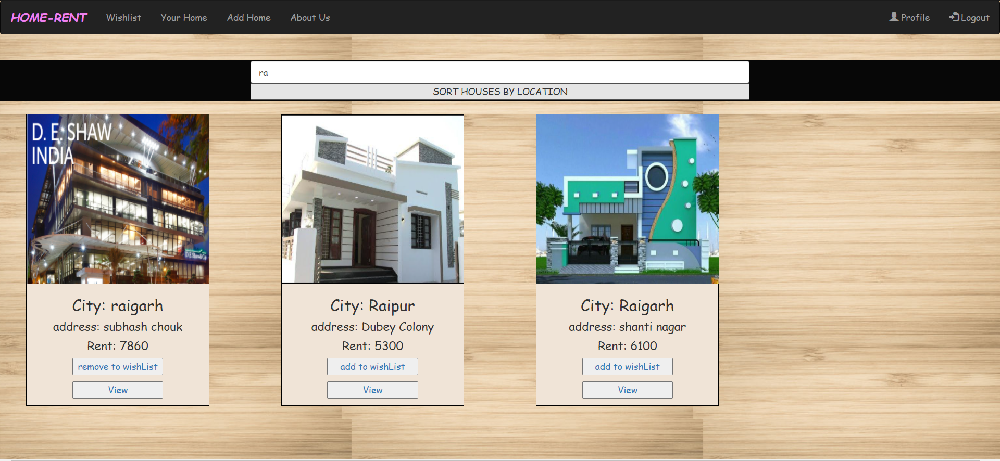
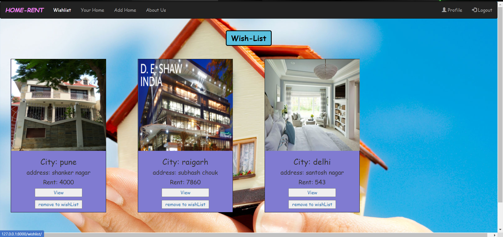
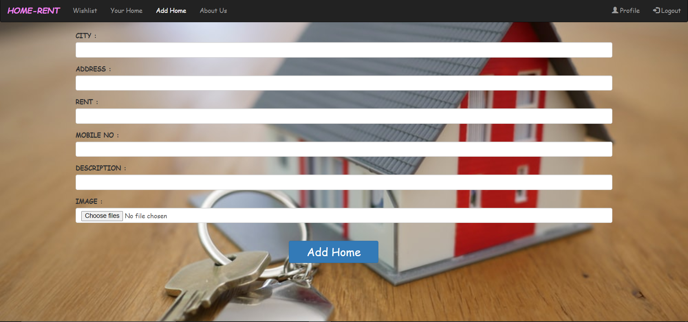

# home_rent
System that provides a common platform for Potential tenants, they can use this website
to search for houses within a particular area, and source information about all property related issues.   

Requirements-
->Django>= 2.2, Python>= 3.3

Demo project- http://satyamjai.pythonanywhere.com/

# WebSite-

  

# Features-

Authentication-

      

Search house in perticular Area-

Wish List-

Add home-

Profile

